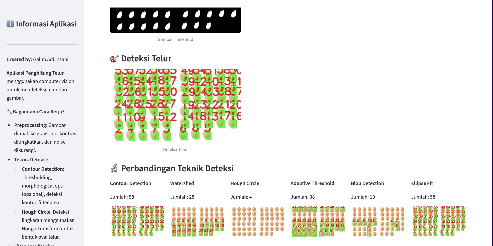

# Penghitung Telur (Telur.py)

Aplikasi web sederhana berbasis Streamlit untuk mendeteksi dan menghitung telur dari citra digital. Aplikasi ini menggunakan berbagai teknik deteksi computer vision (thresholding, contour detection, Hough Circle, Watershed, Blob Detection, dan Ellipse Fit). 

Created by: Galuh Adi Insani

## Fitur
- Upload gambar (JPG/PNG) lalu hitung jumlah telur.
- Beberapa teknik deteksi: Contour, Hough Circle, Adaptive Threshold, Watershed, Blob Detection, Ellipse Fit.
- Mode Auto untuk memilih teknik heuristik berdasarkan ciri citra.
- Parameter UI untuk menyesuaikan threshold, area, dan parameter teknik.
- Filter berdasarkan Circularity dan Solidity untuk mengurangi false positives.
- Opsi untuk menampilkan gambar intermediate (threshold / watershed markers / overlays).
- Visual overlay (bounding box, ellipses, Hough circles) dan nomor label per objek.
- Simpan / load konfigurasi (JSON) untuk reproduceable results.
- Bandingkan hasil dari beberapa teknik secara berdampingan.

## Contoh Hasil Deteksi
Berikut contoh hasil deteksi menggunakan salah satu teknik pada citra uji:




## Instalasi
Python 3.8 - 3.11 direkomendasikan. (OpenCV wheel support may be limited in Python 3.12+)

**Note for Streamlit Cloud / Linux hosts**: Use `opencv-python-headless` rather than `opencv-python` to avoid GUI deps and to reduce platform issues.


1) Buat environment virtual (opsional):

```bash
python3 -m venv .venv
source .venv/bin/activate
```

2) Install dependencies:

```bash
pip install -r requirements.txt
```

## Menjalankan aplikasi

Jalankan perintah berikut dari root folder repository (tempat `telur.py` berada):

```bash
streamlit run telur.py
```

Akses aplikasi pada http://localhost:8501/ (atau port yang ditampilkan oleh Streamlit).

## Petunjuk Penggunaan
- Upload gambar telur.
- Pilih teknik deteksi atau `Auto` untuk memilih teknik heuristik.
- Aktifkan `Sesuaikan Parameter Manual` untuk memunculkan slider: Threshold, Area minimum, parameter teknik.
- Gunakan `Tampilkan gambar intermediate` untuk melihat hasil threshold, overlay, atau marker.
- Jika hasil over/under-detect, sesuaikan `Threshold` atau `Area Minimum`.
- Gunakan `Simpan Konfigurasi` untuk menyimpan pengaturan sebagai `config.json`.
- Gunakan `Load Konfigurasi` untuk memuat kembali konfigurasi.

## Catatan Teknis & Tips
- Aplikasi mengonversi gambar input ke RGB (PIL → numpy array), lalu ke grayscale untuk proses CV.
- Area default sekarang dihitung relatif terhadap resolusi gambar agar lebih reliabel.
- Pilih `Watershed` jika telur saling tumpuk.
- Pilih `Hough Circle` jika telur terlihat bundar jelas dan tidak terlalu overlap.

## Debugging
- Jika muncul warning `use_column_width` atau sejenisnya, sudah diganti ke `width` di `st.image`.
- Jika Streamlit menampilkan error terkait versi, coba perbarui `requirements.txt` dengan versi Streamlit yang kompatibel.

## Kontribusi
- Fork root repo dan buat pull request jika ingin menambah fitur.

## Lisensi
Penggunaan bebas untuk tujuan non-komersial. Hubungi pembuat jika ada pertanyaan/commercial use.
